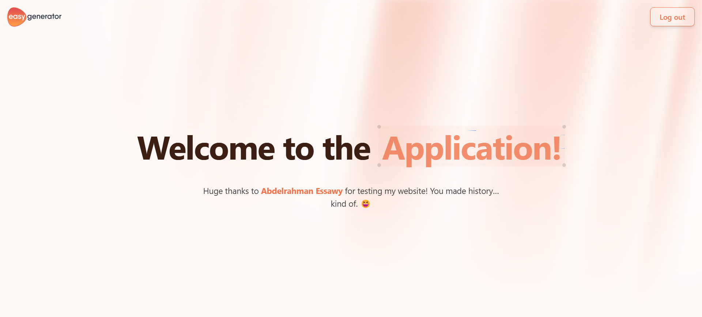
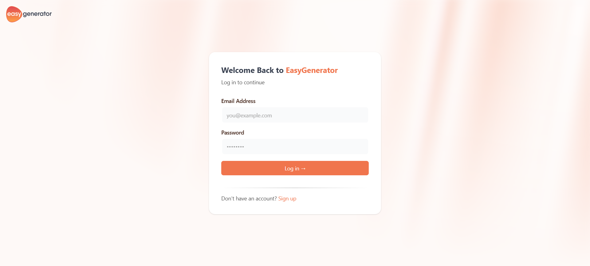
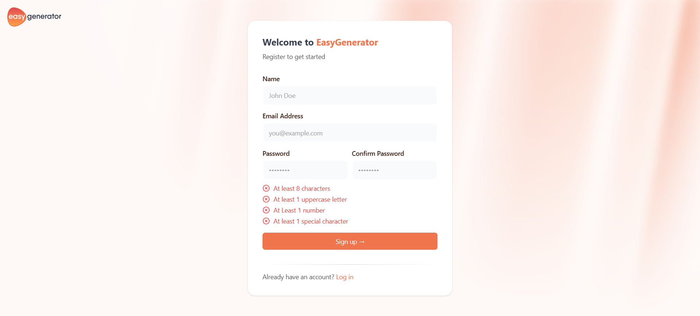

# Full Stack Task – Scalable & Modular Architecture

This repository is a full stack test task showcasing best practices in modern full stack development, designed for a senior-level role application.

---





## Overview

This project demonstrates:
- **Modular Architecture:** A monorepo structure powered by [Nx](https://nx.dev) that separates concerns into different apps and shared packages.
- **TypeScript:** Written entirely in TypeScript across all applications and libraries.
- **Modern Tooling:** Leveraging PNPM for package management, ESLint and Prettier for code quality, and Docker for containerization.

---

## Project Structure

- **apps/**  
  Contains two applications:
    - **frontend:** The client-side application.
    - **backend:** The server-side application.

- **packages/**  
  Contains shared libraries:
    - **validations:** Shared validation rules between the frontend and backend.
    - **api-sdk**  Auto-generated SDK based on backend Swagger docs for type-safe API consumption.
---

## Getting Started

### Prerequisites

- **Node.js:** Ensure you have Node.js (LTS version recommended) installed.
- **PNPM:** This project uses PNPM for managing dependencies. Install it via:

  ```bash
  npm install -g pnpm
- **Docker:** Docker is required to pull and run the MongoDB instance used by this project. Install Docker from docker.com.
- **NX Console (Optional):** A GUI for viewing commands and the project graph; available for WebStorm and VSCode.

### Installation
```
git clone https://github.com/abdelrahman-essawy/Full-Stack-Test-Task.git
cd Full-Stack-Test-Task
pnpm install
cp .env.example .env
```

## Running the Project

### Backend

Run in production mode:

```bash
nx run backend:serve:production
```
#### This command:
- Pulls and starts the MongoDB instance via Docker.
- Builds backend-dependent packages (e.g., "validations").
- Builds and serves the backend application in production mode.

### Frontend
```bash
nx run frontend:preview
```
#### This command:
- Builds frontend-dependent packages (e.g., "validations", "api-sdk").
- Builds and serves the frontend application in production mode.

---

### Primary Technologies
- **Nx:** A set of extensible dev tools for monorepos, with advanced support for TypeScript.
- **React:** A JavaScript library for building user interfaces.
- **NestJS:** A progressive Node.js framework for building efficient, reliable, and scalable server-side applications.
- **Mongoose:** A MongoDB object modeling tool designed to work in an asynchronous environment.
- **Swagger:** A tool for designing, building, and documenting APIs.
- **React-Hook-Form:** Performant, flexible, and extensible forms with easy-to-use validation.
- **Zustand:** A small, fast, and scalable state management library.
- **React-Query:** A data-fetching library for React that provides tools for managing, caching, synchronizing, and updating server state.
- **Pino:** A Node.js logger that logs JSON.
- **Helmet:** Secure Express apps by setting various HTTP headers.

---

### License

This project is provided for evaluation and testing purposes as part of a job application process. Please include your own licensing information if you plan to reuse this code for any other projects.
